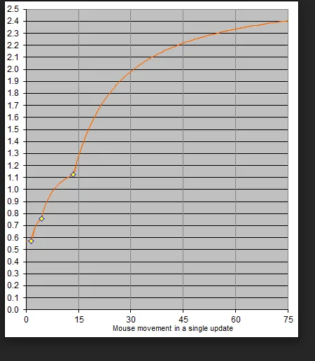
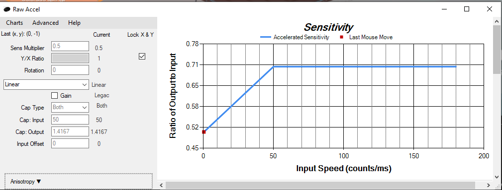
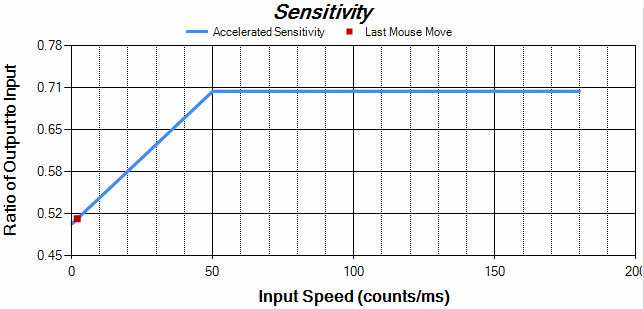
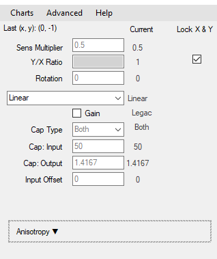
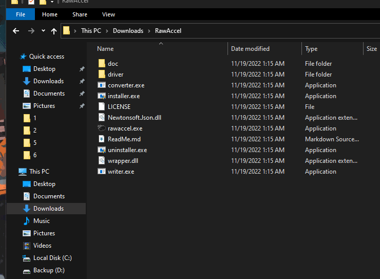
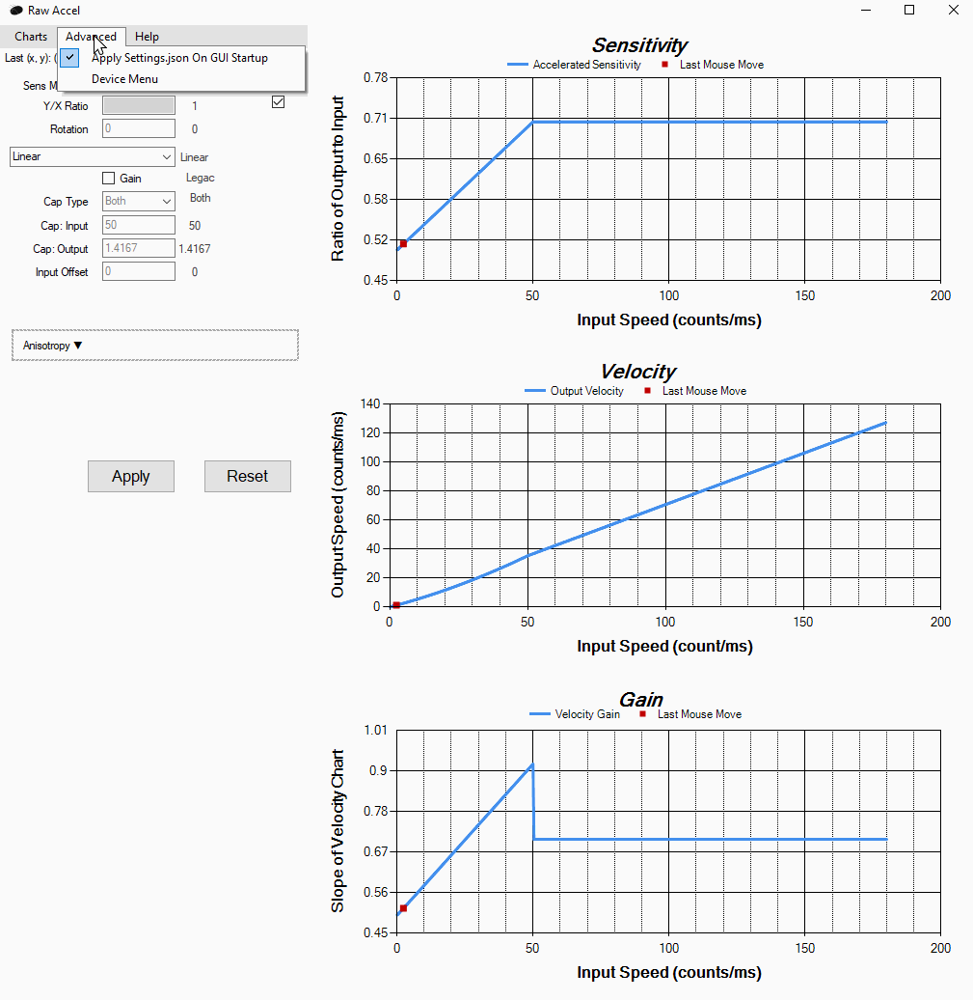
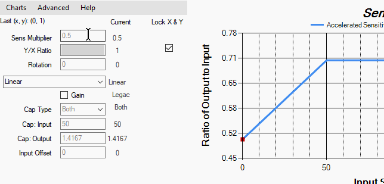
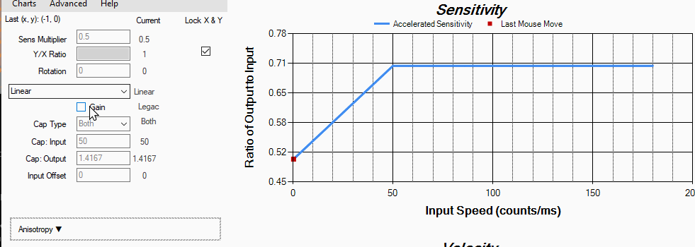
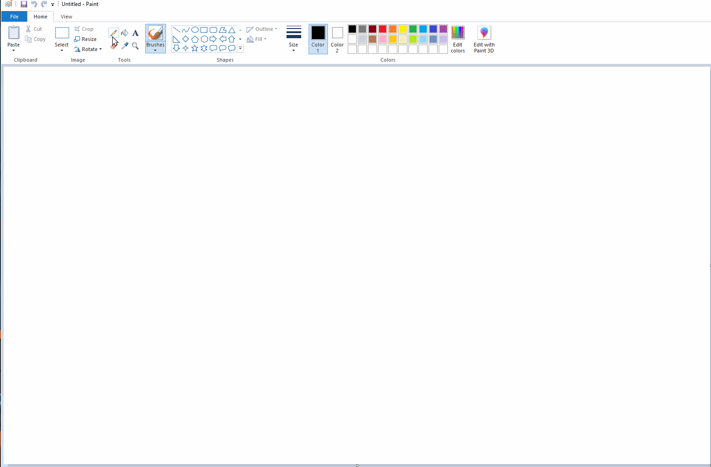

# Raw Accel

*(RawAccel Verison Info I used for this guide)*   
*(GUI Version: 1.6.1.0)*   
*(Driver Version: 1.6.0.0)*   

# Mouse Acceleration
Hello welcome to this guide that is more of a specific guide for people who want to mess around with mouse acceleration, and to be more specific the program called "RawAccel".

#### Some videos showing Mouse acceleration
[Viscose (Apex) - YouTube](https://www.youtube.com/watch?v=KkY28_S5dvg)   
[Sarahcat (Valorant) - YouTube](https://www.youtube.com/watch?v=N2epxrjWKp8)
* * *
## Some info about acceleration
There is a lot of hate around mouse acceleration, one of the biggest reasons it is hated is that it can not be used to "Build Muscle Memory" and that it will cause inconsistency in your aim. I am not going to go super in depth on the down sides or the positives of mouse accel because there are plenty of videos about that already which I will link at the bottom of this guide.

One of the biggest reasons there is a lot of hate around this topic is the fact that the windows accel graph is so bad, and I will attach an image below to show you.   
   
Before I explain what this graph means, let me talk about the basics of mouse acceleration.   

Mouse acceleration is in short term, a way for your mouse sensitivity to increase the faster you move. So for example if you are flicking in a game it will increase your sensitivity while you flick and then bring it back down to a low sense when you how fast you moves slow down.   

The reason Windows acceleration is so hated is because there really is no consistency. In there graph you can see the "**Mouse Movement**" on the X, and the Y is not written but it is "**Sensitivity**". With knowing this info, look at the graph again. The faster you move your mouse the faster your sensitivity gets. But the problem with this graph is there are random jumps in sensitivity, random drops, and no cap to it so it is really...really hard to build up "muscle memory".   

This is about how technical I will get for this part, as again I will link for resources where multiple people have spoke about this before! :)
* * *
## RawAccel
   
This is RawAccel, and this is what the guide is mainly going to be orientated around. In short this is a very well open source program for mouse acceleration, which simplifies (sorta) and streamlines mouse acceleration allowing you to make your own acceleration graph.

The X and Y are the same as before but just for easier reference:
- **X = Input Speed (counts/ms)**
- **Y = Ratio of Output to Input (Sensitivity)**

This is my custom acceleration graph as I have made and tweaked and I am still tweaking it to my liking. But for example if you watch the red dot on this gif, it represents my "last mouse move". The faster I move my mouse the farther right the dot goes which in essence increased the amount of sensitivity I am having.   

   
* * *
## The End Goal
The goal of this guide is to be able to get you the basic understanding of all of the settings on the left side:   

   
(**These are the settings**)   

* * *
## Installing RawAccel
To install RawAccel, you are going to want to go to your browser of choice (Firefox, Chrome, etc...)   

1. Open your browser
   - To do this you can either:
      - Hit your windows key and type what browser you want
      - Click the windows icon on the bottom left (normally unless moved) and then type in the browser you want
      - Double click the Icon that is on your desktop or taskbar (Taskbar is the bar at the bottom of your screen.)   
2. Go to the top bar at the browser or just in the search box and Type "**RawAccel**"   

3. Once you have searched "**RawAccel**" it should be to top link that says "**Github**", you can also you the gif above as reference and I will link it here as well: [rawaccel/Guide.md · GitHub](https://github.com/a1xd/rawaccel/blob/master/doc/Guide.md)   
4. In this guide they do a fairly good job at explaining the install process and I will not go through what they have written down in the guide, just make sure you install the prerequisites.   
      - Prerequisites:
        - Window 10 or Windows 11
        - Visual C++ 2019 runtime (Download link on website above)
        - .NET Framework 4.7.2+ runtime (Download link on website above)   

5. Once you have downloaded the prerequisites, download the *.zip* file that in on the releases page of that link from above (It is also mentioned in the guide on the supplied link).
6. Double click the *.zip* you just downloaded to open it, then just drag and drop the contents to your desktop (or your desired location to store the files (I store it in my documents folder.))
7. Now open up the files you just extracted (the files you drag and dropped out of the *.zip*) and there will be a few files there. Click on the file called "**Installer.exe**" or just "**Installer**". This gif will show what file:   
   

8. Now after you have gone through the installation process it will ask you to restart you computer which you must do.
9. To launch RawAccel all you have to do now, is just go back to the folder that has the contents of the *.zip* you downloaded earlier and double click the filled called "**Rawaccel.exe**" or "**Rawaccel**".
   
## RawAccel UI
Good job! You have successfully installed / started up the program "**RawAccel**"!
   

I know it has been quite technical so far, so if you want you can take a break and then come back later as this is a great stopping point. But if you would prefer you can just click go here:[ Cute Cats](https://letmegooglethat.com/?q=Cute+baby+cats) for a quick cleanser!   

I will wait...   
...   
...   
... They are pretty cute right?   
...   
...   
Okay that is enough lets get this done!
* * *
### **Time to setup the basic settings:**
1. Once you are in the UI for "RawAccel" do the following:
    - Charts -> Scale by mouse settings -> DPI:
      - Set this to **3600** (Will explain later)
    - Charts -> Scale by mouse settings -> Poll Rate:
      - Set this to **1000** (or your mouse poll rate if you know it)
    - Charts -> Scale by mouse settings -> Re-scale by above:
      - Just click "**Re-scale by above**"   
   

2. You will more than likely only see one graph which is the sensitivity graph, to see the other ones do the following:
      - Go to Charts -> and click "**Show Velocity & Gain**"

3. For the red dot on the graphs, it may already be enabled but if it is now you can enable it by:
      - Go to Charts -> and click "**Show Last Mouse Move**"

Those are the basic settings and usually recommended settings for the UI!
* * *
### Time to setup the graph settings:
We are just going to start from top to bottom for these settings and I will try to explain them as best as I can.   

Before we start, we need to make sure you are using the right graph type. There are a lot of them there and you can look it up on the RawAccels github documentation. But the one we will be using and the one I use is "**Linear**".
##### Prerequisites:
1. To enable linear, on the left side panel where all the settings are there will be drop down box under the "**Rotation**" option.   
   
2. Underneath the option for the graph type, there is a box there that says "**Gain**". From my understand of this, it will make your mouse acceleration have a smoother incline but take a little longer. I will show you what it does here:   
   
(As you can see it smooths out the acceleration speed, but I do not prefer this and I like it better with it off. But feel free to change this if you want!)
3. Set your DPI on your mouse to **1600** (This will be in your mouses application or just on your mouse use the DPI switch button).
    - The reason behind this is it will increase how often your mouse updates. In short term, better accuracy. (I know this is very broad for people who do know about this, but I am not trying to get super technical right now.)
    - And if you remember we set the "DPI" option to **3200**. The reason for this is you want to double your DPI and then use that as the "DPI" setting RawAccel.
      - This is because when you double it it will allow a bigger view of the graph so you can more easily see what you are working with.

Now that the prerequisites are out of the way I am just going to go down the settings from top to bottom :). 
1. **Sens Multiplier:**
    - This is How much you want RawAccel to increase you "sensitivity" depending on how fast you move.
      - If you set this to 0.5 and your mouse DPI is at 1600, then your actual mouse DPI will be 800. (Again this is a lot more technical in reality, but I am trying to keep it simple.)
2. **Y/X Ratio:**
    - If you keep the check box under "**Lock X & Y**" checked, this option will be grayed out. I would suggest not messing with this as it just make things more complicated. If you want to, just uncheck the box and mess with it.
3. **Rotation:**
    - Some mice have an issue where if you move it from left to right on your mouse pad, it will not be a straight line. This is due to the fact that the sensor (I think) is slightly rotated/off angled on accident which causes the non straight line.
      - To test this just open up the "**Paint**" app on your computer, click the pencil tool and just hold left click and move your mouse from right to left and left to right with your eyes closed. It will look something like this:   
         
      (General straight lines are what you want, if their are huge curves this is where this setting helps.)
      - A lot of people use RawAccel just for this setting. As what this setting does is fix the rotation through software so if their lines were not straight in the paint example, the will adjust it through RawAccel to make it straight!   
4. **Cap Type:**
    - Cap type is basically an option to adjust future options to affect how your acceleration is managed. I tend to keep this on **both** for more personalization but you can use whatever is more comfortable!   

(These 2 options are based on your "**Cap Type**", if you are on "**Both**" you will see both. If you are on a different option, you will more than likely only see one!)

5. **Cap Input:**
    - Cap input will increase or decrease how fast your sensitivity will increase/decrease. For example a lower number in this setting will cause your sensitivity to accelerate faster. A higher number will cause your sensitivity to accelerate more gradually.
6.  **Cap Output:**
    - Cap output will be the max amount of acceleration you are allowing your sensitivity to increase to. So for an a realistic example, lets say you have your base sensitivity in Valorant at 0.50, this will allow your sensitivity to cap it self at 0.70 and not go any higher than that.

7. **Input Offset:**
    - This setting allows for you to adjust what speed your acceleration start to kick in it. Currently if you leave this at "0" your mouse acceleration has no delay in it and will start kicking in as soon as you start moving your mouse.

* * *
That is all of the basic settings! You should now be able to go through this UI and adjust things how you see fit. I am going to include some resources that will be able to help. But you should now have a decent understanding of what all of these options do and how they affect the graph! Hopefully this helped and will provide you with great outcome!   

**JUST REMEMBER!!!! THIS WILL TAKE A BIT OF MESSING AROUND WITH TO FIND THE RIGHT SETTINGS FOR YOU, BUT I HAVE FAITH YOU WILL FIND IT AND DO NOT GET FRUSTRATED WITH YOURSELF :)**
* * *
## Resources/Quick Links:
- [RawAccel Github](https://github.com/a1xd/rawaccel)
- [Raw Accel Curve Helper](https://docs.google.com/spreadsheets/d/1XGlMuCjrKo3IqWAtYpW3bug6g4FfXFFlOI99aSHKtGA/edit#gid=1574490322) (File > Make a Copy, of this)
  - **Made by:** itsHappyGoLucky
  - **Video guide:** [Raw Accel: Beginners Guide - YouTube](https://www.youtube.com/watch?v=drX3QbLNd3I)
- [500 hours of mouse accel, was it worth it? - YouTube](https://www.youtube.com/watch?v=T44wCJcIaJs)
  - **Made by:** Viscose
  - **Their discord:** https://discord.gg/EyynB9AYUE
  - **Their Twitch:** https://www.twitch.tv/viscoseoce
- [Radiants Think Raw Accel Is INSTANT GOOD AIM - YouTube](https://www.youtube.com/watch?v=RRamrinknBY&list=PLRB9r34UOOS8gMBZfvKihCZmIkQCJqP9M)
  - **Made by:** West Proter
  - This playlist is very good at explaining mouse accel, how it can help, how it can hurt, how to set it up, etc...   
- If I have mentioned you in this guide, please do not feel afraid to reach out if you want anything adjusted or mentioned :).   

That is all I have for now, but will slowly include more as I personally learn more about mouse accel!   

I know this was a big guide, and quite technical as well so thank you for your time in reading this and hopefully it helped :). Let me know if there is anything I can help with, if I do not know the answer I will reach out to someone who does!

This will be a constantly updating guide as well so make sure to check it out every once in a while.